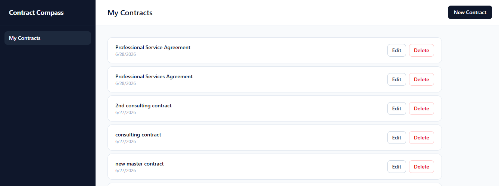
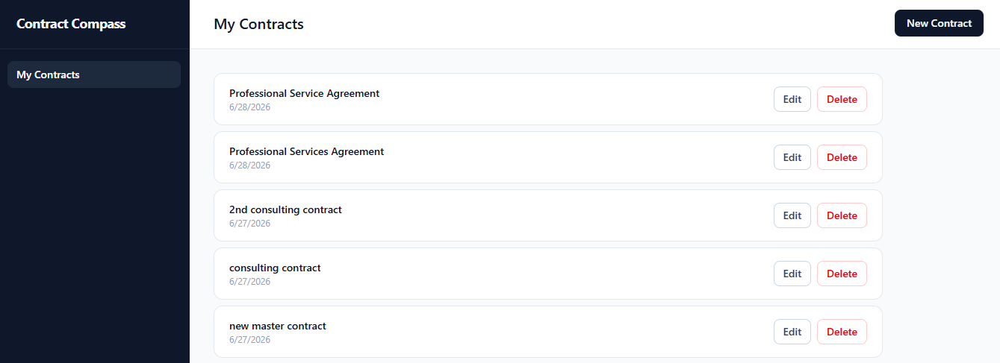
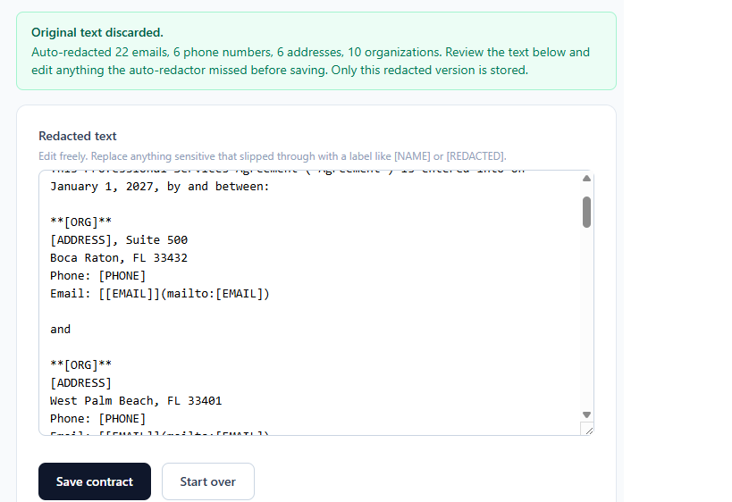
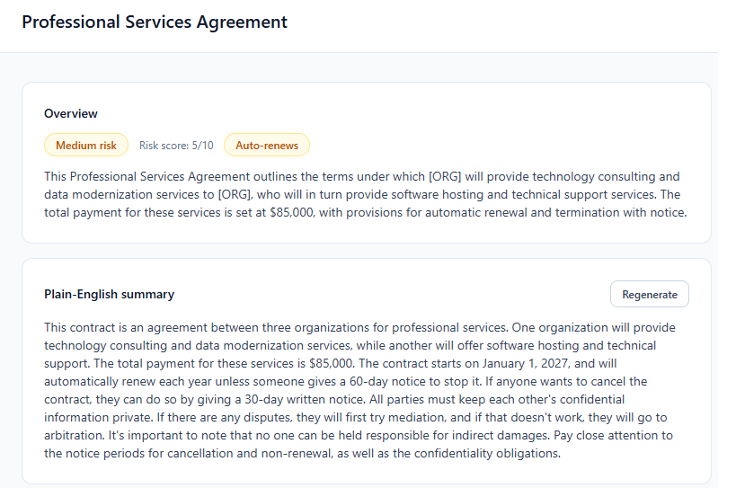

# Contract Compass

A privacy-conscious contract analysis web app. Paste a contract, automatically redact sensitive information, review the redacted version, and get a structured AI breakdown — all without ever storing the original unredacted text.

**Live demo:** https://contract-compassnj.netlify.app/

**Demo video:** https://www.loom.com/share/29af9875e53644d8820019e10a8a6410

---

## Overview

Contract Compass lets a user paste raw contract text, which is **redacted in the browser** before anything is saved. Only the user-approved redacted version is stored, and only that redacted text is ever sent to an AI model for analysis. The original text is never persisted anywhere.

### Core features

- **Authentication** — register, login, logout, persisted session (Supabase Auth)
- **Protected routes** — unauthenticated users are redirected to login
- **Contracts CRUD** — create, view, edit, and delete saved contracts
- **Auto-redaction** — masks emails, phone numbers, SSN-like numbers, addresses, and likely names/organizations with typed labels (`[EMAIL]`, `[PHONE]`, etc.)
- **Manual redaction review** — edit the redacted text before anything is saved or analyzed
- **Per-user data isolation** — enforced at the database layer with Row Level Security
- **Privacy-first storage** — the original unredacted contract text is never stored

## AI features

Contract Compass includes **five distinct AI-powered features**, each with its own serverless endpoint. All run server-side; the AI key is never exposed to the browser, and only redacted text is ever sent to the model.

1. **Contract Analysis** (`/api/analyze`) — structured extraction of summary, risk level/score, auto-renewal, renewal/termination/payment terms, deadlines, and obligations. Saved to the database.
2. **Plain-English Summary** (`/api/plain-english-summary`) — explains the contract in jargon-free language: what it does, how long it lasts, how to cancel, key responsibilities, and major risks. Saved to the database.
3. **Explain a Clause** (`/api/explain-clause`) — paste any clause to get a plain explanation, why it matters, possible risks, and a recommended action. Generated on demand, not saved.
4. **AI-Assisted Privacy Review** (`/api/redaction-suggestions`) — a second AI pass over the already-redacted text to catch identifying details the regex missed (company/personal names, institutions, account numbers). The user approves each redaction manually; nothing is auto-applied or saved as a suggestion.
5. **Missing Clause Detection** (`/api/missing-clauses`) — flags common business clauses (confidentiality, liability, indemnification, governing law, etc.) that appear absent. Saved to the database.

All AI output is informational only and is **not legal advice**. Endpoint request/response formats are documented in [`docs/API.md`](docs/API.md); test cases in [`docs/TEST_CASES.md`](docs/TEST_CASES.md); cost estimates in [`docs/COST_ANALYSIS.md`](docs/COST_ANALYSIS.md).

## Screenshots


|  |  |

| Contract analysis |
|---|
|  |

## Tech stack

| Layer | Technology |
|---|---|
| Frontend | React + Vite |
| Styling | Tailwind CSS |
| Routing | React Router |
| Auth | Supabase Auth |
| Database | Supabase Postgres + Row Level Security |
| Serverless | Netlify Functions |
| AI | OpenAI API (`gpt-4o-mini`, structured JSON extraction) |
| Hosting / CI/CD | Netlify (Git-connected, auto-deploy on push) |

## Architecture

```
Browser (React)
  │
  ├─ Supabase Auth + Postgres  ← per-user data via RLS (auth + CRUD)
  │
  └─ /api/*  →  Netlify Functions  ← serverless, hold the AI key
        ├─ /api/analyze
        ├─ /api/plain-english-summary
        ├─ /api/explain-clause
        ├─ /api/redaction-suggestions
        └─ /api/missing-clauses
                  │
                  └─ OpenAI API  ← receives only redacted text
```

The OpenAI key lives only in the serverless functions' server-side environment. The browser never sees it; it calls a function, and the function calls OpenAI. A shared helper (`netlify/functions/_aiHelper.js`) centralizes request validation, error handling, rate-limit (429) handling, and JSON parsing for all AI endpoints.

## The privacy model

This is the central design constraint of the project:

1. Raw text is pasted into the browser and held **in memory only**.
2. Auto-redaction runs client-side, producing a redacted draft with typed labels.
3. The user reviews and edits the redacted draft. Raw text is discarded the moment redaction runs.
4. **Only the redacted text** is written to the database — there is no column for unredacted text.
5. All AI features receive **only the redacted text**, server-side, via serverless functions.
6. The AI-Assisted Privacy Review adds a second pass to catch what regex missed, but **never auto-applies** a redaction — the user approves each one.

Redaction uses regex/heuristics, which reliably catch structured data (emails, phones, SSNs) but are intentionally conservative on fuzzy data (names, organizations, addresses) to avoid destroying the contract language the AI needs. The **manual review step is the safety net** for anything the auto-pass misses — a human approves the final redacted text before it is stored or analyzed.

## Local development

### Prerequisites

- Node.js 18+
- A Supabase project
- An OpenAI API key
- Netlify CLI (`npm install -g netlify-cli`)

### Setup

```bash
# Install dependencies
npm install

# Copy the example env file and fill in your values
cp .env.example .env
```

Fill in `.env`:

```
VITE_SUPABASE_URL=https://your-project-ref.supabase.co
VITE_SUPABASE_ANON_KEY=your-supabase-publishable-or-anon-key
OPENAI_API_KEY=your-openai-api-key
LLM_MODEL=gpt-4o-mini
```

### Database

Apply the schema in your Supabase project's SQL editor. The full schema, RLS policies, and grants are documented in [`database/schema.md`](database/schema.md), with the entity diagram in [`database/erd.md`](database/erd.md).

### Run

```bash
# Use netlify dev (NOT npm run dev) so serverless functions run locally
netlify dev
```

The app runs at the URL printed by `netlify dev` (typically `http://localhost:8888`). Use that URL — the AI functions are only available through the Netlify proxy.

## Deployment

Deployed on Netlify, connected to GitHub for continuous deployment — every push to `main` triggers a build.

Environment variables (`VITE_SUPABASE_URL`, `VITE_SUPABASE_ANON_KEY`, `OPENAI_API_KEY`, `LLM_MODEL`) are set in the Netlify dashboard, not committed to the repo. SPA routing and function redirects are configured in [`netlify.toml`](netlify.toml).

## Project structure

```
contract-compass/
├── netlify/functions/
│   ├── _aiHelper.js               # shared validation, error/429 handling, JSON parsing
│   ├── analyze.js                 # AI: contract analysis
│   ├── plain-english-summary.js   # AI: plain-English summary
│   ├── explain-clause.js          # AI: explain a clause (on-demand)
│   ├── redaction-suggestions.js   # AI: privacy review suggestions (on-demand)
│   └── missing-clauses.js         # AI: missing clause detection
├── src/
│   ├── components/                # Layout, ProtectedRoute, ClauseExplainer, PrivacyReview
│   ├── context/                   # AuthContext (session management)
│   ├── lib/                       # supabaseClient, contracts, redaction
│   └── pages/                     # Login, Register, Dashboard, ContractForm, ContractDetail
├── database/                      # schema.md, erd.md
├── docs/                          # API.md, TEST_CASES.md, COST_ANALYSIS.md, Postman collection
├── netlify.toml                   # build + redirect config
├── PLAN.md                        # project plan
├── BUILD_STEPS.md                 # incremental build roadmap
└── AGENTS.md                      # AI feature documentation
```

## API cost estimates

The app uses OpenAI `gpt-4o-mini`. Per-call cost is a fraction of a cent; a full demo run of all five features on one contract costs well under $0.01. See [`docs/COST_ANALYSIS.md`](docs/COST_ANALYSIS.md) for the full breakdown and usage notes.

## Security notes

- The AI API key is server-side only (never prefixed with `VITE_`, never in the browser).
- Per-user data isolation is enforced by Postgres Row Level Security, not just application logic.
- Secrets are provided via environment variables and are never committed (`.env` is gitignored).
- Original unredacted contract text is never persisted.
- AI redaction suggestions are never auto-applied — the user approves each one.

## Disclaimer

Contract Compass is an educational and informational tool. Its AI-generated output — including analysis, summaries, clause explanations, and missing-clause suggestions — is **not legal advice** and should not be relied upon as such. Redaction is heuristic and not guaranteed; the manual review step exists precisely because automated redaction cannot be perfect.
