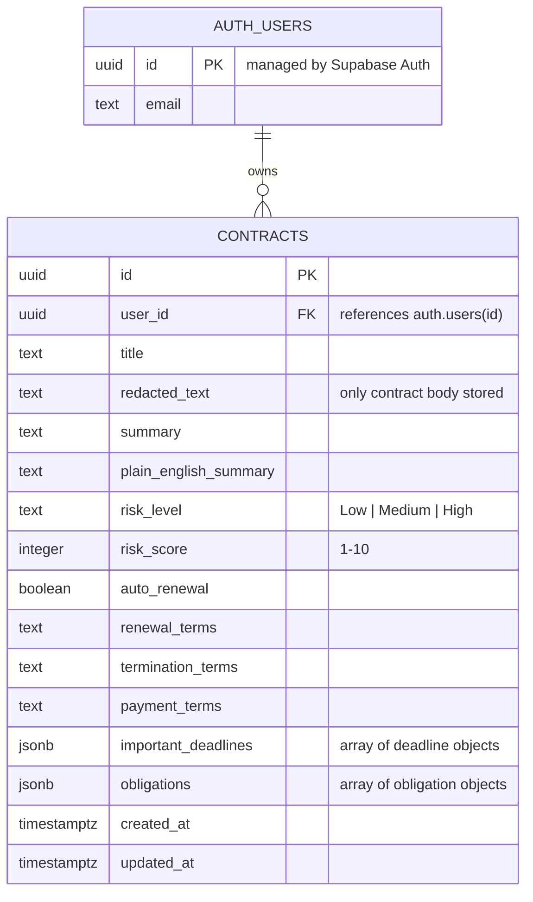

# Entity Relationship Diagram — Contract Compass

The data model is intentionally minimal: Supabase's managed `auth.users` table owns the application's single `contracts` table. The relationship is one user to many contracts, enforced at the row level by RLS.

## Relationships

- **`auth.users` 1 — ∞ `contracts`** via `contracts.user_id` → `auth.users(id)`.
  - `on delete cascade`: deleting a user removes their contracts.
  - RLS scopes every operation to `auth.uid() = user_id`, so the relationship is also the security boundary.

## Notes on the JSONB columns

`important_deadlines` and `obligations` are stored as `jsonb` arrays rather than separate tables. For a mini-project this keeps reads/writes to a single row and matches the AI's structured output directly. If the project grew, these would be the natural candidates to normalize into `deadlines` and `obligations` child tables.

## Privacy by design

There is deliberately **no** entity or column representing the original, unredacted contract text. Raw pasted text exists only transiently in the browser during redaction and is discarded once the user approves the redacted version, which becomes `contracts.redacted_text`.
